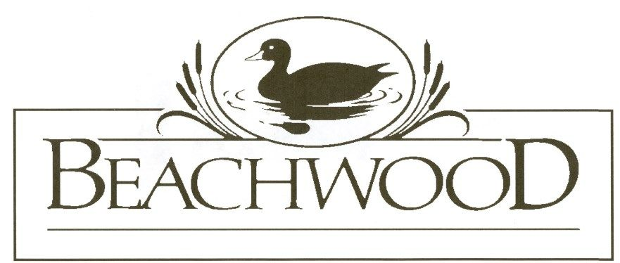

  

  <strong>Beachwood Homeowners Association, Inc.</strong>
  This is the website for the Beachwood subdivision of Wake County, NC.

<nav class="page-nav">
  <a href="#news">News</a>
  <a href="#contact">Contact</a>
  <a href="#dues">Dues</a>
  <a href="#violations">Violations</a>
  <a href="#documents">Documents</a>
  <a href="membership_meeting">Meetings</a>
  <a href="#board">Board</a>
</nav>

  
News

  
No current announcements.

  

    
Contact

    
This website, occasional mailings, and the email address below are the <strong>only official channels</strong>. We do not use social media or distribute newsletters.

    

      Email
      <a href="mailto:beachwood.hoa.inc@gmail.com">beachwood.hoa.inc@gmail.com</a>
    

    

      Mail
      Beachwood Homeowners Association, Inc. P.O. Box 1198 Knightdale, NC 27545
    

  

  

    
HOA Dues

    
$243

    
Annual assessment &mdash; 2026

    
Send a check or money order payable to &ldquo;Beachwood Homeowners Association, Inc.&rdquo; to the mailing address. Please include your <strong>property address</strong> in the memo line.

  

  
Violations

  
All homeowners are bound by the <a href="https://drive.google.com/file/d/1sXEQ5biblpdFaENFtViTgPRbcpOQYm-x/view?usp=drive_link">Covenants and Restrictions</a>, including amendments. Violations are handled in accordance with the HOA&rsquo;s <a href="violations">published procedures</a>.

  
Documents &amp; Records

  
Public documents &mdash; board meeting minutes, governing documents, architectural forms, notices, and more &mdash; are available on Google Drive. Membership meeting details, including agendas, proxy voting, and budget summaries, are on the <a href="membership_meeting">Meetings page</a>.

  <a class="btn" href="https://drive.google.com/drive/folders/1_-tm8V_nUE70x1_UTEimFcTi776MbLtS?usp=drive_link">
    View public documents &rarr;
  </a>

  
Board Members

  
The HOA is a NC not-for-profit entity. Board members serve 2-year terms. All current seats were elected in November&nbsp;2025; the next election is <strong>November&nbsp;2027</strong>.

  <table class="board-table">
    <thead>
      <tr>
        <th>Name</th>
        <th>Position</th>
      </tr>
    </thead>
    <tbody>
      <tr><td>Clyde Thompson</td><td>President</td></tr>
      <tr><td>Justin Murphy</td><td>Vice President</td></tr>
      <tr><td>Sal LaRocca</td><td>Treasurer</td></tr>
      <tr><td>Rob Jones</td><td>Secretary</td></tr>
      <tr><td>Perri Davenport</td><td>Member</td></tr>
    </tbody>
  </table>
  

    
Board member links

    <ul>
      <li><a href="https://github.com/users/saljinlr/projects/1">Project board</a></li>
      <li><a href="https://github.com/saljinlr/beachwood-hoa">Knowledge repository</a></li>
      <li><a href="https://drive.google.com/drive/folders/1FTfRWxEOffus-xh-Zg0sHXluXewCWweB?usp=drive_link">Beachwood HOA private Google Drive</a></li>
    </ul>
  

